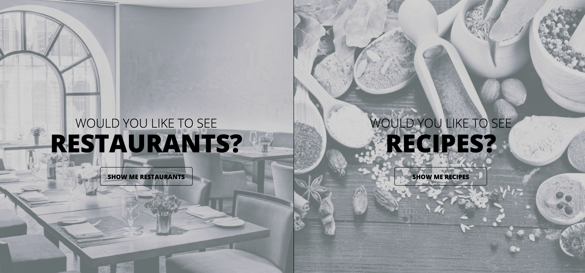

# Restaurant and Recipe Roulette
Ever feel hungry and don't know what to cook with your leftover? Click on the Recipe to find recipes based on ingredients you have. What if you don't feel like cooking and want to eat out? Click on the restaurant and pick what kind of food you're craving to find the closest restaurant near you. This app provides for all your hungry needs.

Deployed site: https://xiongkb.github.io/Team4/

*Due to sensitive information, deployed restaurant section will not call google places api, you will have to download repository and enter your own google api token*

How it works?
Our team utilized google places api to search up restaurants near your zip code. Meanwhile in the recipe section, edamon's api calls are used to grab recipes based on ingredients you input.
